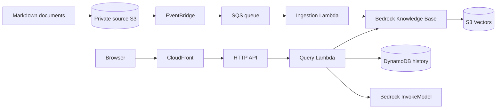

# Bedrock RAG Chatbot on AWS

This repository contains a low-cost Amazon Bedrock RAG chatbot implemented with two independent Terraform root stacks, Python Lambda functions, and a vanilla HTML/CSS/JavaScript frontend.



## Repository Structure

The code is organized into source documents, Lambda functions, frontend assets, Terraform modules, two root stacks, environment examples, validation scripts, and AI context files under `ai_context/`.

## Prerequisites

Install Terraform `1.12.2` or newer compatible with the pinned provider lock files. Install Python 3.12 locally to run Lambda unit tests. Configure AWS credentials only when you are ready to plan or deploy.

You must enable model access for `amazon.titan-embed-text-v2:0` and `amazon.nova-micro-v1:0` in `ap-south-1` before deployment. S3 Vectors and Bedrock Knowledge Bases with S3 Vectors also need to be available in the selected account and region.

## Cost Warning

This project is designed for a small Free Tier or credit account, but it is not free by guarantee. Budgets can alert late. Immediate guardrails are low API throttling, Lambda reserved concurrency, small retrieval counts, short log retention, DynamoDB provisioned `5/5`, and no NAT Gateway, VPC, OpenSearch, Aurora, KMS customer key, or provisioned Bedrock throughput.

## Backend Values

Both stacks use the same existing S3 backend bucket with different state keys. Example files are in `infra/environments/dev/`.

## Validate Locally

```bash
terraform fmt -check -recursive
terraform -chdir=infra/stacks/core init -backend=false
terraform -chdir=infra/stacks/core validate
terraform -chdir=infra/stacks/application init -backend=false
terraform -chdir=infra/stacks/application validate
python -m unittest discover -s src/ingestion_lambda/tests
python -m unittest discover -s src/query_lambda/tests
python scripts/validate_iam.py
python scripts/check_cost_guardrails.py
```

## Deployment Order

1. Configure core backend.
2. Plan and apply core.
3. Confirm the SNS email subscription if configured.
4. Verify SSM parameters exist.
5. Wait for initial Knowledge Base ingestion to complete.
6. Configure application backend.
7. Plan and apply application.
8. Open the CloudFront domain.
9. Test the chatbot.

The application stack reads the Knowledge Base ID, model ID, and SNS topic ARN from SSM Parameter Store. It cannot plan successfully before the core stack has created those parameters.

## GitHub Actions Pipeline

The repository includes a unified Terraform workflow at `.github/workflows/terraform.yml`.

It supports pull-request static validation, same-repository speculative PR plans, manually triggered trusted plans, exact saved-plan apply, and exact saved-plan destroy. No workflow automatically applies on push, and no static AWS access keys are used.

Required repository variables:

```text
AWS_ROLE_ARN
AWS_REGION
AWS_ACCOUNT_ID
TF_STATE_BUCKET
TF_STATE_REGION
TF_STATE_PREFIX
TF_ALERT_EMAIL
TF_MONTHLY_BUDGET_LIMIT_USD
```

Optional repository variable:

```text
AWS_PLAN_ROLE_ARN
```

Suggested values:

```text
AWS_REGION=ap-south-1
TF_STATE_REGION=ap-south-1
TF_STATE_PREFIX=bedrock-rag
TF_MONTHLY_BUDGET_LIMIT_USD=5
```

Manual trusted plan:

```text
Actions -> Terraform -> Run workflow -> action=plan, stack=core
```

Manual apply uses the exact saved plan artifact:

```text
Actions -> Terraform -> Run workflow -> action=apply, stack=core, source_run_id=<manual-plan-run-id>
```

Manual destroy requires an exact confirmation such as:

```text
DESTROY dev application
```

Destroy uses a saved destroy plan generated in the same workflow run, then applies that saved plan in a separate job. Destroy `application` before `core`.

The workflow uses maintained major action versions. Pinning every third-party action to a reviewed commit SHA remains a supply-chain hardening recommendation.

## Commands

```bash
terraform -chdir=infra/stacks/core init -backend-config=../../environments/dev/core.backend.hcl
terraform -chdir=infra/stacks/core plan -var-file=../../environments/dev/core.tfvars.example

terraform -chdir=infra/stacks/application init -backend-config=../../environments/dev/application.backend.hcl
terraform -chdir=infra/stacks/application plan -var-file=../../environments/dev/application.tfvars.example
```

Do not run `apply` until you have reviewed the plans and confirmed Bedrock access and budget expectations.

## API

`POST /api/chat`

```json
{"sessionId":"browser-generated-uuid","message":"How does Terraform state locking work?"}
```

Successful responses contain `sessionId`, `answer`, and numbered `citations`.

## Documents and Ingestion

Terraform uploads the Markdown files under `documents/` to the private source bucket. S3 emits EventBridge object events, EventBridge sends them to SQS, and the ingestion Lambda starts a Bedrock Knowledge Base ingestion job when no active job already exists.

## Frontend

The frontend stores only a random browser session ID in `localStorage`, sends messages to the relative path `/api/chat`, renders text safely without `innerHTML`, and displays citations below assistant responses.

## Alarms and Budget

CloudWatch alarms monitor ingestion Lambda error rate, query Lambda error rate, API Gateway 5xx rate, and DynamoDB throttling. An AWS monthly cost budget defaults to `$5` and sends notifications to the shared SNS topic. Budget data can be delayed.

## Troubleshooting

If the application stack cannot read SSM parameters, deploy the core stack first. If Bedrock returns access denied, enable model access and verify regional availability. If no citations appear, confirm source documents were uploaded and ingestion completed.

## Destroy Order

1. Destroy the application stack.
2. Confirm application state is empty.
3. Wait until no Knowledge Base ingestion job is active.
4. Destroy the core stack.

## Security Notes

This demo has no end-user authentication and permits wildcard CORS on the API for direct testing. Production should add authentication, explicit CORS origins, abuse protection, detailed logging review, and tighter operational runbooks.
