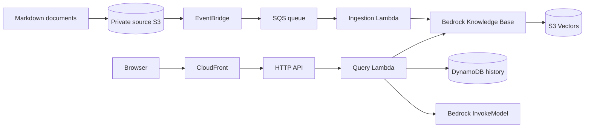

# Bedrock RAG Chatbot on AWS

This repository contains a low-cost Amazon Bedrock RAG chatbot implemented as one Terraform root under `infra/`, with two internal modules: `modules/core` for the knowledge-plane resources and `modules/application` for the chatbot application resources.



## Repository Structure

- `infra/` is the single Terraform root.
- `infra/modules/core/` creates documents, vectors, the Knowledge Base, ingestion, SNS, alarms, and SSM parameters.
- `infra/modules/application/` creates DynamoDB, query Lambda, API Gateway, frontend hosting, CloudFront, alarms, and the monthly budget.
- `src/` contains the ingestion and query Lambda handlers plus unit tests.
- `frontend/` contains the vanilla HTML, CSS, and JavaScript chat UI.
- `documents/` contains the sample knowledge-base corpus.
- `ai_context/` records the current architecture, IAM, pipeline, and application behavior.

This repository is intentionally kept framework-light to stay easy to review and inexpensive to run.

## Prerequisites

- Terraform `1.15.1` or newer compatible with the pinned lock file
- Python `3.12` for local unit tests
- AWS access only when you are ready to plan or deploy

Enable model access for `amazon.titan-embed-text-v2:0` and `amazon.nova-micro-v1:0` in `ap-south-1` before deployment. S3 Vectors and Bedrock Knowledge Bases with S3 Vectors must also be available in the target account and region.

## Cost Warning

This project is designed for a small Free Tier or credit account, but it is not guaranteed free. Cost guardrails include:

- low API throttling
- Lambda reserved concurrency
- small retrieval count
- short log retention
- DynamoDB provisioned `5/5`
- no NAT Gateway, VPC, OpenSearch, Aurora, or customer-managed KMS key
- no provisioned Bedrock throughput

## Backend Values

The Terraform root uses a shared existing S3 backend bucket with one state key. Copy `infra/backend.hcl.example` to `infra/backend.hcl` and update it for your shared backend bucket.

Example key:

```text
bedrock-rag/dev/terraform.tfstate
```

## Validate Locally

```bash
terraform fmt -check -recursive
terraform -chdir=infra init -backend=false
terraform -chdir=infra validate
python -m unittest discover -s src/ingestion_lambda/tests
python -m unittest discover -s src/query_lambda/tests
python -m unittest discover -s scripts/tests
python scripts/validate_iam.py
python scripts/check_cost_guardrails.py
```

## Deployment Model

There is one Terraform root, but the resources are still separated internally:

- `modules/core` creates the Bedrock knowledge-plane components and writes IDs to SSM Parameter Store.
- the root then reads those SSM parameters during deployment
- `modules/application` receives those resolved values and creates the user-facing application resources

That means the whole system can be planned and applied in one run while still keeping the internal module boundary clear.

## GitHub Actions Pipeline

The repository includes two Terraform workflows:

- `.github/workflows/terraform-pr-plan.yml` for speculative PR plans and sticky PR comments
- `.github/workflows/terraform-dispatch.yml` for manual `plan`, `apply`, and `destroy`

It supports:

- pull-request static validation
- same-repository speculative PR plans
- manually triggered trusted plans
- exact saved-plan apply
- exact saved-plan destroy

No workflow automatically applies on push, and no long-lived AWS access keys are stored in GitHub.

Required repository variables:

```text
AWS_REGION
AWS_ACCOUNT_ID
TF_STATE_BUCKET
TF_STATE_REGION
TF_STATE_PREFIX
TF_ALERT_EMAIL
TF_MONTHLY_BUDGET_LIMIT_USD
```

Suggested values:

```text
AWS_REGION=ap-south-1
AWS_ROLE_ARN=arn:aws:iam::484632959006:role/aws-chatbot
TF_WORKING_DIRECTORY=infra
TF_STATE_REGION=ap-south-1
TF_STATE_KEY=bedrock-rag/dev/terraform.tfstate
TF_MONTHLY_BUDGET_LIMIT_USD=5
```

Manual trusted plan:

```text
Actions -> Terraform Dispatch -> Run workflow -> action=plan
```

Manual apply uses the exact saved plan artifact:

```text
Actions -> Terraform Dispatch -> Run workflow -> action=apply, source_run_id=<manual-plan-run-id>
```

Manual destroy requires an exact confirmation string:

```text
DESTROY
```

## Commands

```bash
terraform -chdir=infra init -backend-config=backend.hcl
terraform -chdir=infra plan -var-file=terraform.tfvars
```

Copy `infra/terraform.tfvars.example` to `infra/terraform.tfvars` before planning.

## API

`POST /api/chat`

```json
{"sessionId":"browser-generated-uuid","message":"How does Terraform state locking work?"}
```

Successful responses contain `sessionId`, `answer`, and numbered `citations`.

## Documents and Ingestion

Terraform uploads the Markdown files under `documents/` to the private source bucket. S3 emits EventBridge object events, EventBridge sends them to SQS, and the ingestion Lambda starts a Bedrock Knowledge Base ingestion job when no active job already exists.

## Frontend

The frontend stores only a random browser session ID in `localStorage`, sends messages to the relative path `/api/chat`, renders text safely without `innerHTML`, and displays citations below assistant responses.

## Alarms and Budget

CloudWatch alarms monitor ingestion Lambda error rate, query Lambda error rate, API Gateway 5xx rate, and DynamoDB throttling. An AWS monthly cost budget defaults to `$5` and sends notifications to the shared SNS topic.

## Troubleshooting

- If Bedrock returns access denied, enable model access and verify regional availability.
- If no citations appear, confirm source documents were uploaded and ingestion completed.
- If plan/apply cannot read the backend, verify the shared state bucket, lockfile permissions, and OIDC role access.

## Security Notes

This demo has no end-user authentication and permits wildcard CORS on the API for direct testing. Production should add authentication, explicit CORS origins, abuse protection, detailed logging review, and tighter operational runbooks.
